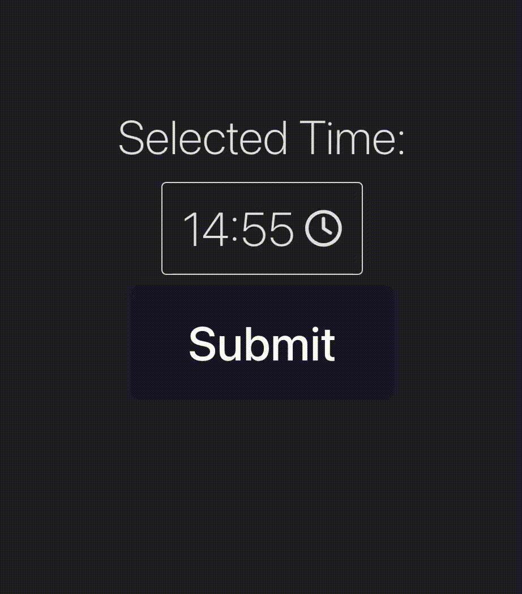

# rhf-time-picker

a simple time picker component for react-hook-form





## Install

```bash
npm i @craftgear/rhf-time-picker
```

## Usage

```tsx
import React from 'react';
import { useForm } from 'react-hook-form';
import { TimePicker } from 'rhf-time-picker';

const App = () => {
  const { setValue, handleSubmit } = useForm();
  const onSubmit = (data) => {
      console.log(data);
  };

  return (
    <form onSubmit={handleSubmit(onSubmit)}>
      <TimePicker
        name="time"
        setValue={setValue}
        defaultValue="12:00"
      />
      <button type="submit">Submit</button>
    </form>
  );
};
```

## Can I just use `{...register('time')}` like normal input elements?
 
Unfortunately no.

I couldn't find the way to fire `change` event on input elements for the life of me.
Except for using `input._valueTracker?.setValue()` which I'd like to avoid using.

So I resorted to using `setValue` function from `react-hook-form` to set the value.

## Props

Name                    | Type                                  | Default   | Desscription
---                     | ---                                   | ---       | ---
name                    | string                                |           | **required** name of the input
setValue                | (name: string, value: string) => void |           | **required** setValue function from `useForm`
defaultValue            | string                                | undefined | default value of the input
hourRange               | number[]                              | [0, 23]   | range of hours
minStep                 | number                                | 5         | step of minutes
okButtonText            | string                                | 'OK'      | text of the OK button
showClockIcon           | boolean                               | true      | whether to show the clock icon
style                   | React.CSSProperties                   | undefined | style of the TimePicker
className               | string                                | undefined | className of the TimePicker 
popupClassName          | string                                | undefined | className of the popup
selectClassName         | string                                | undefined | className of hour and minut select
okButtonClassName       | string                                | undefined | className of the OK button
selectedOptionClassName | string                                | undefined | className of the selected hour/minute option

